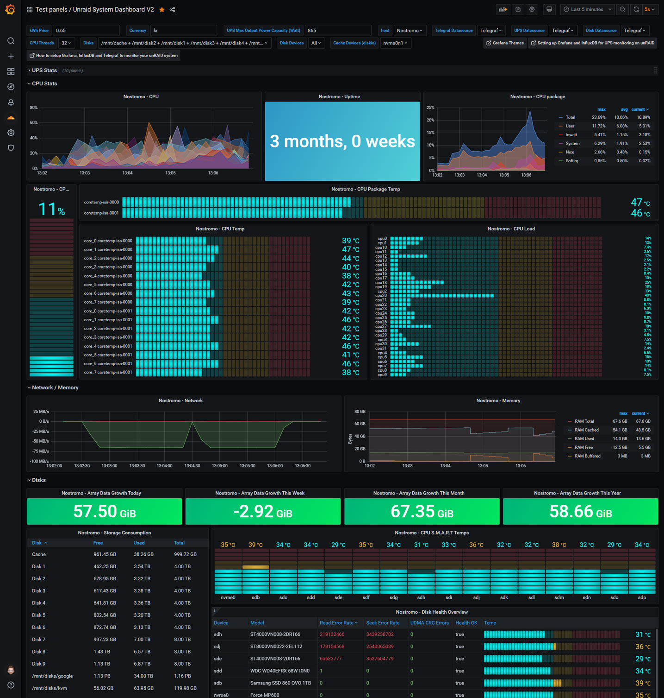

# nut-influxdbv2
Docker image to pulls data from a NUT server and push it to an InfluxDB bucket. Based on work of [mihai-cindea](https://github.com/mihai-cindea/nut-influxdb-exporter) and [dbsqp](https://github.com/dbsqp/nut-influxdbv2).

## Docker Image 

The docker image is available on https://hub.docker.com/r/jwillmer/nut-influxdbv2

## Environment variables with default values
Only setting `INFLUXDB2_TOKEN` is required if the default values are sufficient.

| Variable Name        | Default Value           | Required  | Note |
| -------------------- | ----------------------- | --------- | ---- |
| INFLUXDB2_HOST       | localhost               |           |      |
| INFLUXDB2_PORT       | 8086                    |           |      |
| INFLUXDB2_ORG        | Home                    |           |      |
| INFLUXDB2_TOKEN      |                         | true      |      |
| INFLUXDB2_BUCKET     | DEV                     |           |      |
| INFLUXDB2_SSL        | false                   |           | Default assumes HTTP connection |
| INFLUXDB2_SSL_VERIFY | false                   |           | Default will validate HTTPS certificates and throw an error if invalid |
| INFLUXDB2_MEASUREMENT| ups_status              |           | Measurment name in InfluxDB |
|                      |                         |           |      |
|                      |                         |           |      |
| NUT_HOST             | 127.0.0.1               |           |      |
| NUT_PORT             | 3493                    |           |      |
| NUT_PASSWORD         |                         |           |      |
| NUT_USERNAME         |                         |           |      |
| WATTS                |                         | true      | Only required if UPS does not output ups.realpower.nominal |
| UPS_NAME             | UPS                     |           | Defined name of the UPS in NUT |
| INTERVAL             | 21                      |           | How often the UPS gets queried in seconds |

## Source Code
The source code is available on https://github.com/jwillmer/nut-influxdbv2

## Unraid
This image is referenced in the Unraid community store. The template for the image can be found in the [template repository](https://github.com/jwillmer/unraid-templates). Regular users don't have to care about the template, the reference is only interesting to developers.

## Grafana
A good dashboard for the collected data can be found with the dashboard id [10914](https://grafana.com/grafana/dashboards/10914-unraid-nut-ups-dashboard-tr/).
